# 摘要：

附最终代码图：

# 学到的知识：

# 功能模块：

注：

1.下文简写 能量单元/能量核心 为 方块

2.货仓，即指存储方块的机械结构

3.微动模式，即指一种受限的底盘运动子状态，通过软件限制最大速度、降低加速度，提高控制分辨率，使机器人在狭小空间或精密对接场景下实现厘米级位移控制，避免因惯性或操作过冲导致碰撞或定位失败

4.各模块开发间有重叠部分。前模块提及后，之后的模块若重复出现，会一笔带过

## 机械臂自动拾取模块

功能描述：本模块负责“摄像头识别目标→坐标解算→机械臂自动夹取”全流程

主要技术选型：车载视觉、多自由度机械臂、平行夹爪、

思路概述：

开发历程：

##### -2026-09-13 ：思考技术选型

初期我们针对此模块，考虑了如下问题：

| 摄像头安放 | 优势        | 难点                   |
| ----- | --------- | -------------------- |
| 手眼一体  | 精度高，可多次微调 | 标定难度高，并且还要解决机械臂抖动的问题 |
| 车载视觉  | 标定难度低     | 坐标解算难度高              |

| 得分方式   | 优势              | 难点                                                          |
| ------ | --------------- | ----------------------------------------------------------- |
| 夹取方块   | 收益稳定            | 1.如何比对手更快拿到更多方块                                             |
| 抢夺他人方块 | 收益高（抢一个方块近似抓两个） | 1.对于不同形状的货仓，视觉识别难度将多大增加；2.靠近对方车体有被判“冲撞”的风险；3.如果对方车仓关闭，将难以抓取 |

考虑到时间紧迫，我们决定以稳定得分为主，选择了手眼一体+夹取方块为主的方案（后来改为车载视觉+夹取方块）

##### -2026-09-17：技术选型-平行夹爪

| 夹爪类型 | 优势          | 难点                                                 | 方案                               |
| ---- | ----------- | -------------------------------------------------- | -------------------------------- |
| 平行夹爪 | 结构简单，控制极简   | 如何保证夹取不掉落、优化夹取效率                                   | 1.在爪内壁贴上泡沫板、硅胶等物，增大摩擦；2.优化机械臂结构等 |
| 角度夹爪 | 动作快，抢方块方便   | 如何在“矮墙机制”“洞穴机制”下夹取方块                               |                                  |
| 钩爪   | 抓取动作极简、抓取稳定 | 方块内径只有20* 20mm(后1.4版本规则调整为15* 15mm)，对视觉定位、电控精度要求极高 |                                  |

综合考虑得分场景后，我们选择设计平行夹爪：

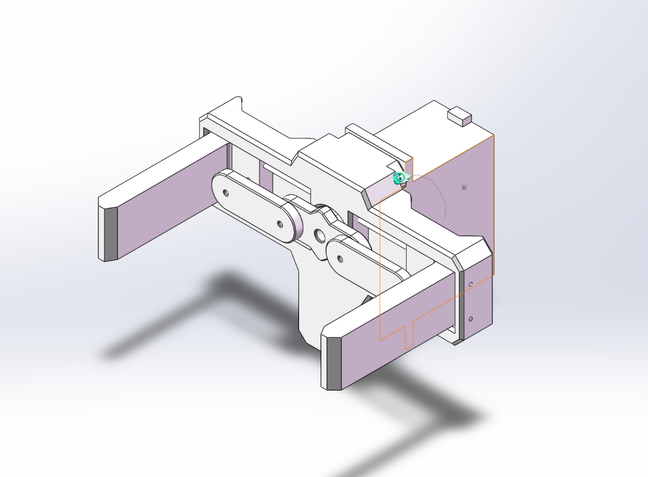

同时设计了机械臂结构思路（不过2026-09-30改了机械臂结构，没用这版）：

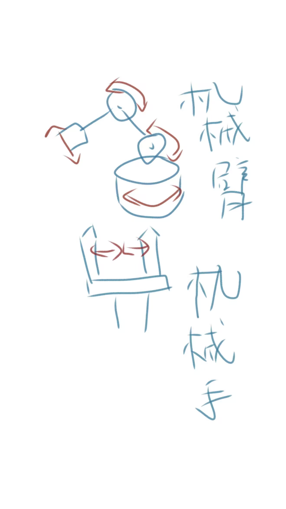

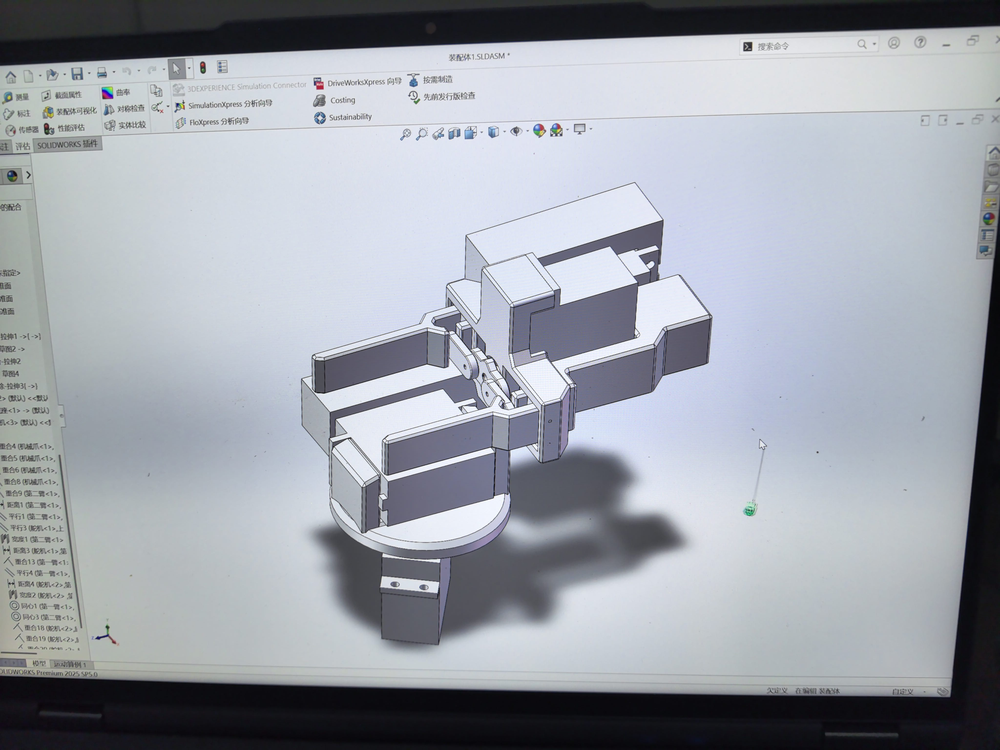

##### -2026-09-27：技术选型-摄像头位置

通过咨询学长，发现手眼一体实际设计中存在布线易损、图像不稳定等问题，于是我们选择了风险更低的车载视觉方案

##### -2026-09-28：技术选型-拾取方式

针对方块变轻变小的问题，重新讨论了方块拾取方式，排除了风机（方块镂空不好吸）、扫取（需要调整底盘、重写电控代码，工作量变大而最终效果与机械臂方案近似）、单向钩锁（对夹取精度要求太高）等方案，最终考虑继续使用机械臂。

机械臂的优势：1.由于方块的倒角处理，夹取无需精确对齐，只需保证方块在两爪中间即可稳定夹取；2.网络上优化方案多样，出现问题便于及时调整；3.舵机在机械臂根部，使得小车重心较其他方案稳定。在此基础上，我们选用动力较大的mg996r舵机，以保证夹取力道稳定

机械臂的劣势  都有对应的解决方案：1.对于结构易损、怕摔的问题，我们设计了爆发式车体对抗模块，保证在被别车、挤压时，可以稳居安全位置；2.对于比赛中的“短墙机制”“洞穴”等，我们将设计不同的抓取程序应对不同场景

##### -2026-09-29：训练视觉模型

打印了方块，开始采集样本对模型进行训练。

考虑到实际比赛过程存在压缩伪影、传感器噪声、低光噪点等问题，同时为了防止过拟合，我们采用OpenCV设计了高斯噪声+椒盐噪声程序，对图片加噪。

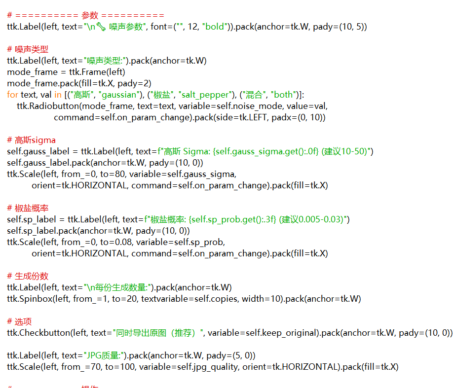

##### -2026-09-30：技术选型-机械臂优化

我们发现了更抗造的机械臂结构，最大的好处在把舵机移动到底座附近，改善了运动机构质量分布，1.更稳更抗撞2.更快

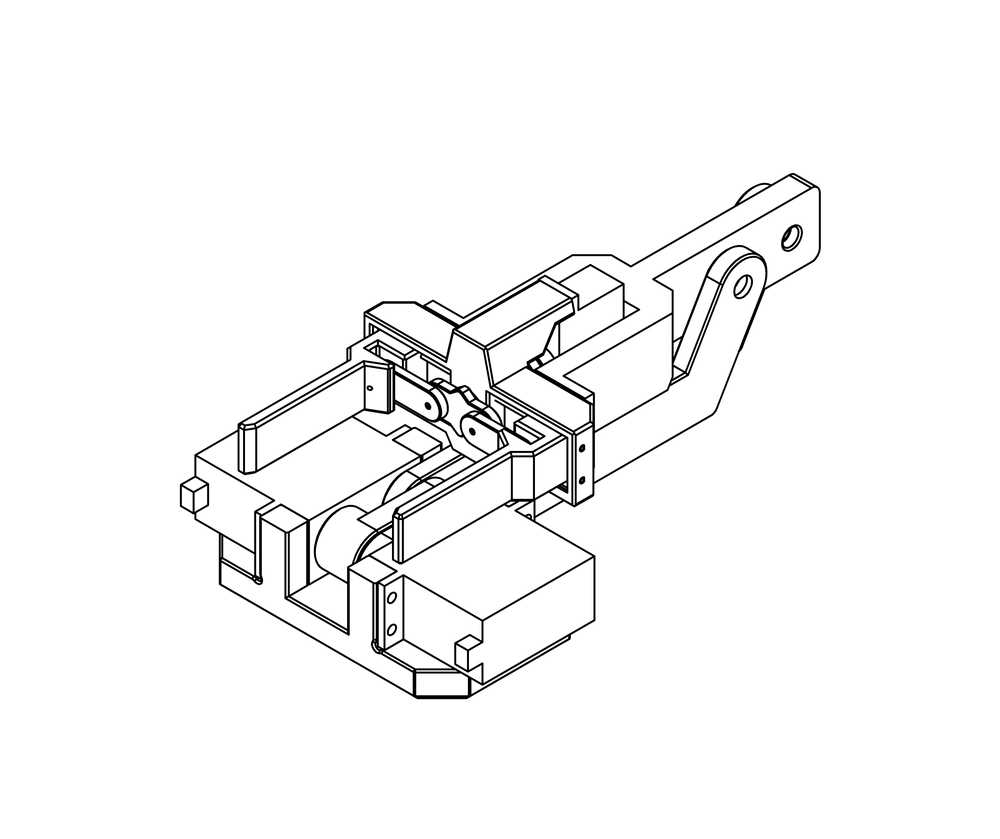

但这也引发了问题：机械臂是360度转的，定位难度大大提升，为此我们讨论了以下方案，最终决定使用编码器电机测速（于2026-10-2讨论得出）

| 方案        | 优势     | 问题                           |
| --------- | ------ | ---------------------------- |
| 机械限位+程序控时 | 简单、成本低 | 舵机特别有力，但比赛对小车有限重，材料不足可能导致限不住 |
| 换成带反馈的舵机  | 精度高    | 太贵了。超预算了                     |
| 编码器电机测速   | 精度高    | 技术上比较难                       |

##### -2026-10-1：优化-视觉训练过程

视觉发现一张一张拍照训练时间太长了，写了个把视频抽帧为图片的程序。在不同光照下采集了训练样本来训练模型，跑了672张图片，模型准确度99.5%

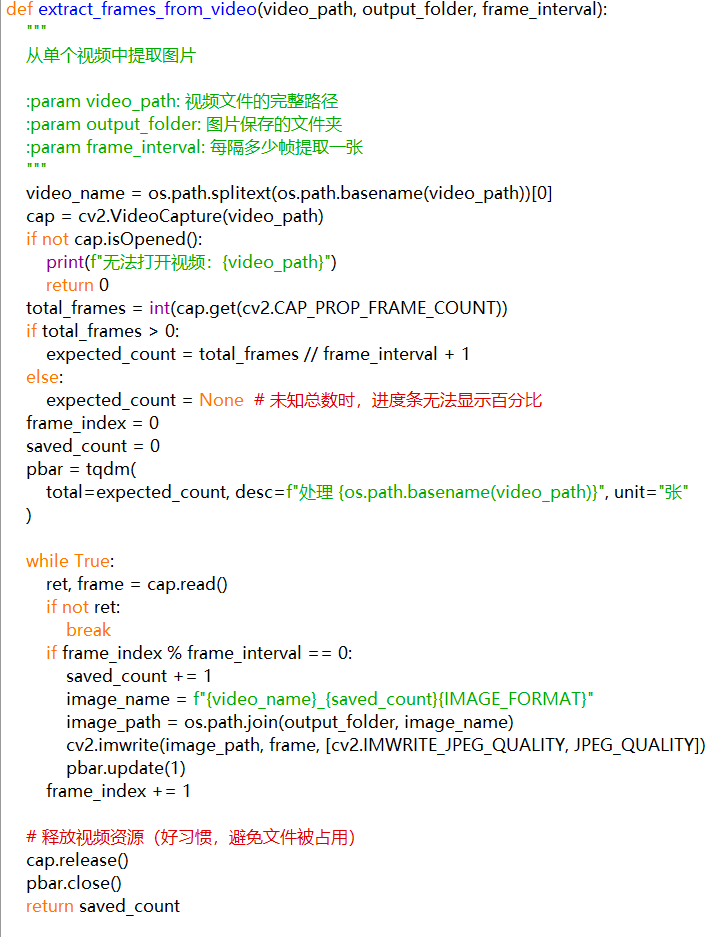

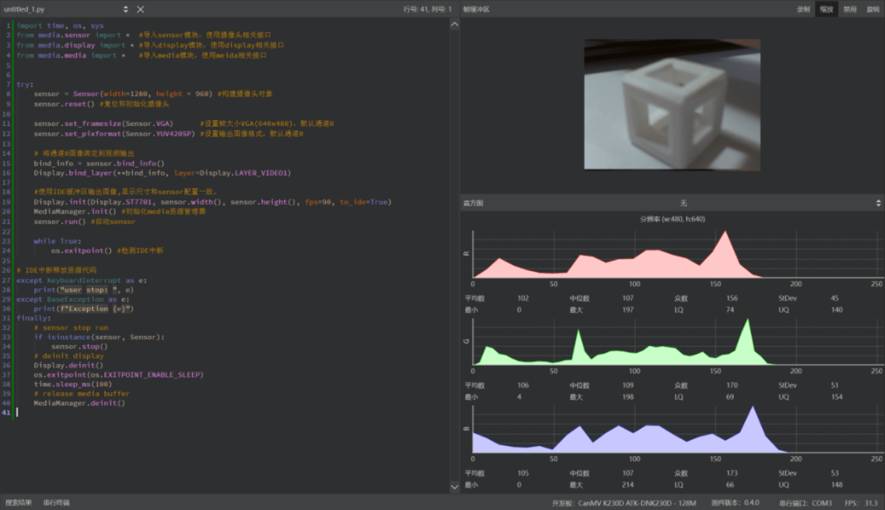

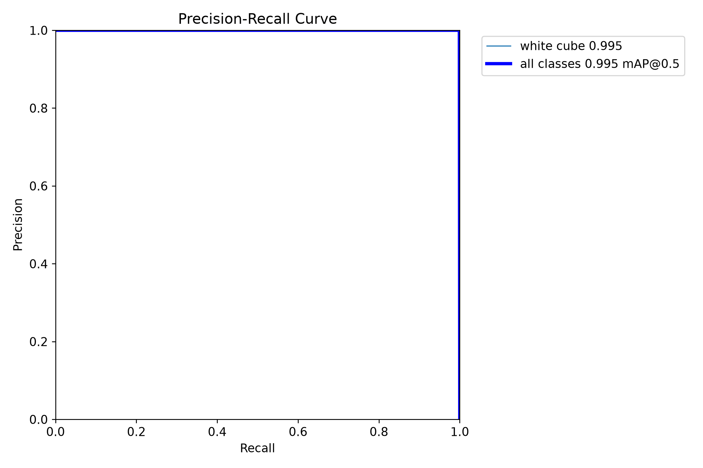

##### -2026-10-2：问题与方案-摄像头过低

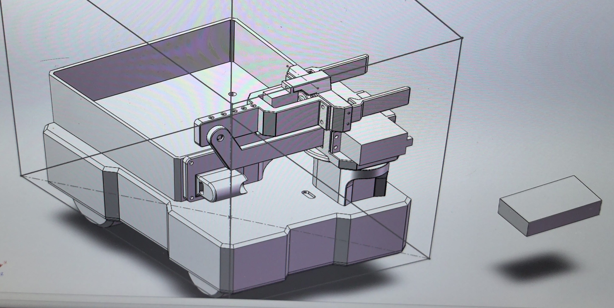

小车结构存在一个问题--摄像机过低会看不见“台阶”上的方块。考虑到限重，我们决定在原放置摄像头处，架起碳棒让摄像头相对位置变高（这可能会导致线缆过长-供电不稳的问题，不过从后期实机表现看，这个问题并不明显）

##### -2026-10-4

视觉跑通串口协议

##### -2026-10-4:问题与方案-摄像头过低

标定时用的是地面上的标定板，算出来的矩阵只对“离摄像头距离为地面高度”的那个平面成立，台阶和高台上的方块比地面高，摄像头看到的像素位置和地面平面不匹配，用地面矩阵算出来的 dist_mm 会偏大或偏小，误差可能达到几十毫米甚至更多

| 解决方案           | 优势  | 难点                                |
| -------------- | --- | --------------------------------- |
| 重新写个点云深度判断的代码  | 精确  | 算力爆炸，如何找到算力需求小的代码、如何在经费有限的情况下扩充算力 |
| 标定地面，用电控代码进行补偿 |     | 工作量大，且由于车载视觉，抓取高台上的方块会难不少         |

考虑到时间有限，我们决定只标定地面，把地面方块的抓取跑通。 台阶、高台、杆上的方块，优先靠 x, y 坐标引导机械臂去抓，dist_mm 不要求精确

##### -2026-10-5：优化-OpenCV保底方案

效果如下

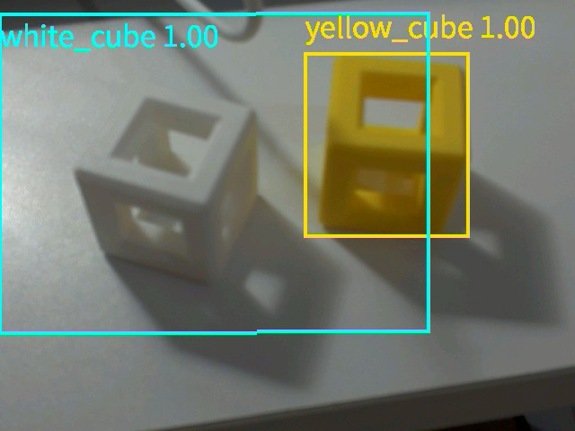

## 货仓储存模块

功能描述：本模块负责货物的存储、码放与防掉落。货仓暂存目标，仓口设单向限位防脱落

思路概述：

开发历程：

##### -2026-09-13：需求分析与技术选型

小车有被抢夺方块的风险，得给货仓加个盖

| 货仓类型     | **优势**       | **难点**            |
| -------- | ------------ | ----------------- |
| 抽屉式      | 取放方便，结构直观    | 需要额外滑轨空间，增加重量和故障点 |
| 翻斗式      | 可快速倾倒方块得分    | 结构复杂，需额外舵机控制，可靠性低 |
| 固定仓+单向限位 | 结构简单，重量轻，防掉落 | 方块可能卡住，需要引导槽设计    |

综合考虑比赛限重与防抢夺需求，我们选择 固定仓+单向限位 方案，并在仓口加装可开合仓盖

## 遥控移动模块

功能描述：本模块负责远程操控车体运动

主要技术选型：

思路概述：

开发历程：

##### -2026-09-13：需求分析与技术选型

| 底盘类型  | 优势              | 难点                 |
| ----- | --------------- | ------------------ |
| 麦克纳姆轮 | 全向移动，可横向平移，对接精准 | 控制复杂，需要运动学解算，轮子易磨损 |
| 四轮差速  | 结构简单，爬坡能力强      | 不能横向移动，转向半径大       |
| 履带式   | 越野抓地力强，通过性好     | 重量大，速度慢            |

| 通信方式          | 优势           | 难点               |
| ------------- | ------------ | ---------------- |
| 蓝牙HC-05       | 成本低，开发快      | 距离短（约10m），易受同频干扰 |
| WiFi（ESP8266） | 距离远，速度快，可传图像 | 需要路由器，功耗高，协议复杂   |
| 2.4G专用遥控      | 专业，低延迟，抗干扰   | 需要额外遥控器，成本高      |

| **方案** | **优势**        | **难点**    |
| ------ | ------------- | --------- |
| 低底盘    | 降低重心，抗造，防对方卡轮 | 通过性变差，易铲地 |
| 高底盘    | 通过性好          | 重心高，易翻车   |
| 可升降底盘  | 兼顾两者          | 结构复杂，重量大  |

面对限重、实际场地等需要，我们最终选择了 麦克纳姆轮+蓝牙HC-05+高底盘 的方案（后改为低底盘，要做对抗）

##### -2026-09-14：优化-可移动性

针对桥梁限高20cm的情况，我们决定做可收纳的机械臂

##### -2026-09-15：思路-自动减速模块

当检测与目标到距离为15cm时，小车开启微动模式进行减速，稳定底盘

##### -2026-09-15：思路-移动模式-爬坡

针对爬坡摩擦力可能不足、烧板等情况，我们决定起步先用30%PWM进行启动，启动完毕再调换为5%PWM爬坡

##### -2026-09-25

配置 USART1 (PA9/PA10) 串口，采用 DMA + 空闲中断 的非阻塞接收架构，实现了麦轮运动与蓝牙无线调参

附核心代码：

/* 麦轮运动学逆解函数 */
void Move(float vx, float vy, float omega) {
    float speed_FL = vx - vy - omega; // 左前
    float speed_FR = vx + vy + omega; // 右前
    float speed_BL = vx + vy - omega; // 左后
    float speed_BR = vx - vy + omega; // 右后

   Set_Motor_PWM(speed_FL, speed_FR, speed_BL, speed_BR);

}

/* 蓝牙无线调参逻辑（主循环内判断） */
if (rx_buffer[0] == 'F') { // 手机蓝牙发来的前进指令
    Move(300, 0, 0); // 基础速度300，实现前进
} else if (rx_buffer[0] == 'B') {
    Move(-300, 0, 0);
}

##### -2026-09-28

设计了一套成熟的 $TARGET,x,y,dist,flag# 坐标解析协议。利用 sscanf 提取虚拟坐标数据，并通过点亮 PC13 小灯验证通信。同时，搭建了串口调试系统，通过 USB转TTL 模块，结合 printf 重定向，实现了实时遥测数据的回传

附核心代码：

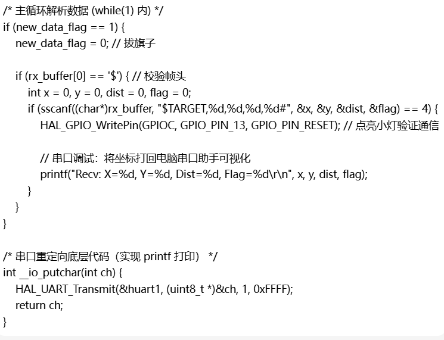

##### -2026-10-06

将 PWM 配置到定时器 TIM3 的四路通道，集成并测试了蓝牙模块（HC-05）

## 爆发式车体对抗模块

功能描述：本模块负责被别车/堵桥时挤压开对方车体

主要技术选型：

思路概述：

开发历程：

##### -2026-09-16：需求分析与技术选型

机械臂结构很脆，如果摔到地上容易坏。但由于小车限重，增大其结构稳定性代价偏大。所以考虑反挤压，设计该模块进行反制

| **对抗策略**  | **优势**          | **难点**           |
| --------- | --------------- | ---------------- |
| 增大PWM顶开   | 简单直接，响应快，无需额外硬件 | 可能烧电机，耗电剧增       |
| 机械弹射机构    | 瞬间爆发力大，效果震撼     | 结构复杂，重量大，还可能违反规则 |
| 重心压制（低裙边） | 稳定，不耗电，防倾倒      | 需要精确设计底盘高度       |

综合考虑实现难度与效果，选择增大PWM+低裙边组合作为核心对抗方案。这要求稳定的底盘、重心、耐挤的车体与备用电池

##### -2026-09-17：技术选型-低裙边

低裙边1.降低重心2.抗造，同时对限重限高影响不大，可行（后期所得小车图片如下）

##### -2026-09-20：优化-重心稳定

针对机械臂位置导致的重心不稳，一、调整了电池等物的相对位置，使重心相对平衡；二、备选方案-电控补偿代码，对转速进行微调（后来发现影响不大，未使用该方案）

因为方块很轻（后发现是11-12g，确实轻），所以忽略方块进入货仓产生的重心偏移

##### -2026-09-28：技术选型-对抗触发方式

| **触发方式**  | **优势**     | **难点**        |
| --------- | ---------- | ------------- |
| 手动按键触发    | 操作手可控，误触发少 | 需要操作手分心，反应可能慢 |
| 压力传感器自动触发 | 自动响应，速度快   | 需要额外传感器，可能误触  |
| 电流检测自动触发  | 通过电机负载判断被卡 | 需要电流检测电路，算法复杂 |

为简化控制，选择 手动按键触发 对抗模式：操作手在感觉被挤压时按下特定按键，电控立即将驱动轮PWM提升至70%，持续1秒后自动恢复

##### -2026-09-30：优化-重心稳定

改了机械臂结构（详见“机械臂自动拾取模块2026-09-30”）

##### -2026-10-1：优化-电压稳定

车上一共三种电压，最坏的情况会同时烧毁元件。因此我们决定分开供电、补上降压板来分压，再补上电容进行稳定

##### -2026-10-06

成功跑通了 PWM 呼吸灯实验（修改 CCR 调节亮度）
